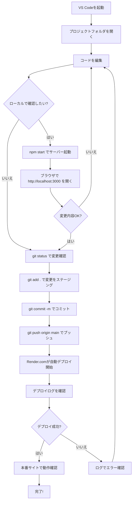
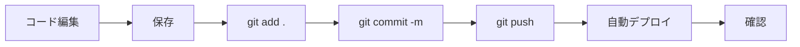

# デプロイ手順ガイド

このガイドでは、PCゲームレビューサイトの変更をローカルで確認してから本番環境にデプロイする手順を説明します。

## 📋 目次

1. [前提条件](#前提条件)
2. [全体フロー図](#全体フロー図)
3. [詳細手順](#詳細手順)
4. [トラブルシューティング](#トラブルシューティング)

---

## 前提条件

以下がセットアップ済みであることを確認してください：

- ✅ VS Codeがインストールされている
- ✅ Node.jsがインストールされている
- ✅ Gitがインストールされている
- ✅ GitHubアカウントとリポジトリが作成されている
- ✅ Render.comでサイトがデプロイされている
- ✅ MongoDB Atlasがセットアップされている

---

## 全体フロー図



---

## 詳細手順

### ステップ1: VS Codeを起動してプロジェクトを開く

1. **VS Codeを起動**
   - デスクトップまたはスタートメニューからVS Codeを起動

2. **プロジェクトフォルダを開く**
   ```
   File > Open Folder > C:\Users\hider\mytool を選択
   ```

3. **ターミナルを開く**
   ```
   Ctrl + ` (バッククォート)
   または
   Terminal > New Terminal
   ```

### ステップ2: コードを編集

1. **編集したいファイルを開く**
   - 左側のエクスプローラーからファイルを選択
   - 例: `views/index.ejs`, `public/css/style.css`, `routes/articles.js` など

2. **コードを変更**
   - 必要な変更を加える
   - Ctrl + S で保存

### ステップ3: ローカルで動作確認（推奨）

#### 3-1. サーバーを起動

ターミナルで以下を実行：

```powershell
npm start
```

以下のメッセージが表示されれば成功：
```
サーバーが起動しました: http://localhost:3000
MongoDB接続成功
```

#### 3-2. ブラウザで確認

ブラウザで以下を開く：
```
http://localhost:3000
```

#### 3-3. 変更内容を確認

- ページが正しく表示されるか
- 変更箇所が反映されているか
- エラーが出ていないか

#### 3-4. サーバーを停止

確認が終わったらターミナルで：
```
Ctrl + C
```

### ステップ4: 変更をGitにコミット

#### 4-1. 変更ファイルを確認

```powershell
git status
```

**出力例：**
```
Changes not staged for commit:
  modified:   views/index.ejs
  modified:   public/css/style.css
```

#### 4-2. 変更をステージング

**全てのファイルを追加する場合：**
```powershell
git add .
```

**特定のファイルだけ追加する場合：**
```powershell
git add views/index.ejs
git add public/css/style.css
```

#### 4-3. コミット

```powershell
git commit -m "変更内容の簡潔な説明"
```

**良いコミットメッセージの例：**
- `git commit -m "トップページのデザインを更新"`
- `git commit -m "記事詳細ページに評価表示機能を追加"`
- `git commit -m "ナビゲーションバーのスタイルを修正"`

**悪い例：**
- `git commit -m "更新"` ❌ (何を変更したか不明)
- `git commit -m "fix"` ❌ (何を修正したか不明)

### ステップ5: GitHubにプッシュ

```powershell
git push origin main
```

**出力例：**
```
Enumerating objects: 7, done.
Counting objects: 100% (7/7), done.
...
To https://github.com/rurugames/game-review-site.git
   abc1234..def5678  main -> main
```

### ステップ6: Render.comで自動デプロイを確認

#### 6-1. Render.comのダッシュボードを開く

ブラウザで以下を開く：
```
https://dashboard.render.com/
```

#### 6-2. サービスを選択

- 「game-review-site」をクリック

#### 6-3. デプロイログを確認

1. 左メニューから **「Events」** または **「Logs」** をクリック
2. デプロイの進行状況を確認

**デプロイ中の表示：**
```
Building...
Build successful
Deploying...
```

**デプロイ成功の表示：**
```
Deploy live
サーバーが起動しました: http://localhost:10000
MongoDB接続成功
```

#### 6-4. デプロイ完了まで待つ

- 通常2〜5分程度かかります
- 緑色の「Deploy live」と表示されたら完了

### ステップ7: 本番サイトで動作確認

#### 7-1. 本番サイトにアクセス

ブラウザで以下を開く：
```
https://game-review-site.onrender.com
```

#### 7-2. 変更内容を確認

- 変更が反映されているか確認
- 各機能が正常に動作するか確認
- 特に以下をチェック：
  - ページの表示
  - Googleログイン
  - 記事の作成・編集・削除

#### 7-3. キャッシュのクリア（必要な場合）

変更が反映されない場合：
```
Ctrl + Shift + R (キャッシュをクリアして再読み込み)
```

---

## 🔎 デプロイ後のSEOチェック（推奨）

デプロイ直後に「SEOタグが本番で出ているか」を即時確認できます。

### 1) 環境変数の確認（重要）

- Renderの環境変数で `SITE_URL` が本番URLになっていること
   - 例: `https://game-review-site.onrender.com`
   - canonical / sitemap の絶対URLに使われます

### 2) robots.txt / sitemap.xml の確認

- `https://game-review-site.onrender.com/robots.txt`
   - `Sitemap: https://game-review-site.onrender.com/sitemap.xml` が出ていること
- `https://game-review-site.onrender.com/sitemap.xml`
   - `<urlset>` が返り、主要ページと記事URL（`/articles/<id>`）が含まれること

### 3) headタグ（canonical/robots/OG/JSON-LD）の確認（PowerShell）

```powershell
$u="https://game-review-site.onrender.com/"
$html=(Invoke-WebRequest -UseBasicParsing $u).Content
$head=($html -split '</head>')[0]
$head | Select-String -Pattern '<title>|rel="canonical"|meta name="robots"|meta name="description"|property="og:|name="twitter:|application/ld\+json' -AllMatches
```

推奨チェック先:

- `/`（トップ）: `index,follow` + canonical + OG/Twitter + WebSite JSON-LD
- `/search?q=test`（検索）: `noindex,nofollow` になっていること
- `/articles/<id>`（記事詳細）: `og:type=article` + Article JSON-LD

### 4) Google Search Console（反映確認）

- プロパティ登録（URLプレフィックス）: `https://game-review-site.onrender.com/`
- サイトマップ送信: `https://game-review-site.onrender.com/sitemap.xml`
- URL検査で、インデックス状況・選択されたcanonical等を確認

## 🎯 クイックリファレンス

### よく使うコマンド

```powershell
# サーバー起動（ローカル確認）
npm start

# 変更ファイル確認
git status

# 全ての変更を追加
git add .

# コミット
git commit -m "変更内容"

# プッシュ（デプロイ開始）
git push origin main

# ブランチ確認
git branch

# 最新のコミット履歴を表示
git log --oneline -5
```

### ディレクトリ構造

```
mytool/
├── views/              # HTMLテンプレート（EJS）
│   ├── index.ejs      # トップページ
│   ├── dashboard.ejs  # ダッシュボード
│   ├── layout.ejs     # 共通レイアウト
│   └── articles/      # 記事関連ページ
├── public/
│   └── css/
│       └── style.css  # スタイルシート
├── routes/            # ルート定義
│   ├── index.js       # ホーム・ダッシュボード
│   ├── auth.js        # 認証
│   └── articles.js    # 記事CRUD
├── models/            # データモデル
│   ├── User.js        # ユーザー
│   └── Article.js     # 記事
├── config/
│   └── passport.js    # 認証設定
├── server.js          # エントリーポイント
├── package.json       # 依存関係
├── .env              # 環境変数（Git管理外）
└── .gitignore        # Git除外ファイル
```

---

## トラブルシューティング

### 問題1: `npm start` でエラーが出る

**症状：**
```
Error: Cannot find module 'express'
```

**解決方法：**
```powershell
npm install
```

---

### 問題2: MongoDB接続エラー

**症状：**
```
MongooseError: Operation `articles.find()` buffering timed out
```

**解決方法：**
1. MongoDB Atlasのネットワークアクセスを確認
2. `.env`の`MONGODB_URI`が正しいか確認
3. MongoDB Atlasで「0.0.0.0/0」を許可

---

### 問題3: Gitのプッシュが失敗する

**症状：**
```
! [rejected] main -> main (fetch first)
```

**解決方法：**
```powershell
# リモートの変更を取得してマージ
git pull origin main

# 再度プッシュ
git push origin main
```

---

### 問題4: デプロイに失敗する

**症状：**
Render.comで「Deploy failed」と表示

**解決方法：**
1. Render.comのLogsタブでエラーメッセージを確認
2. 環境変数が正しく設定されているか確認：
   - `GOOGLE_CLIENT_ID`
   - `GOOGLE_CLIENT_SECRET`
   - `CALLBACK_URL`
   - `MONGODB_URI`
   - `SESSION_SECRET`
   - `NODE_ENV=production`

---

### 問題5: 変更が本番サイトに反映されない

**原因と解決方法：**

1. **デプロイが完了していない**
   - Render.comで「Deploy live」になるまで待つ

2. **ブラウザのキャッシュ**
   - `Ctrl + Shift + R` でキャッシュクリア

3. **Gitにプッシュし忘れ**
   ```powershell
   git status  # コミットされているか確認
   git log     # プッシュされているか確認
   ```

---

### 問題6: Googleログインが動作しない

**解決方法：**

1. **Google Cloud Consoleの設定を確認**
   - 承認済みのリダイレクトURIに以下が含まれているか：
     ```
     https://game-review-site.onrender.com/auth/google/callback
     ```

2. **Render.comの環境変数を確認**
   - `CALLBACK_URL`が正しいか
   - `GOOGLE_CLIENT_ID`と`GOOGLE_CLIENT_SECRET`が正しいか

---

## 📝 チェックリスト

デプロイ前に以下を確認：

- [ ] コードの変更を保存した
- [ ] ローカルでテストした（npm start）
- [ ] エラーが出ていない
- [ ] `git status` で変更ファイルを確認した
- [ ] 適切なコミットメッセージを書いた
- [ ] Render.comの環境変数は正しく設定されている
- [ ] MongoDB Atlasのネットワークアクセスは許可されている

---

## 🚀 デプロイフロー（簡易版）



---

## 📞 サポート

問題が解決しない場合：

1. **Render.comのログを確認**
   - https://dashboard.render.com/
   - Logs タブでエラー内容を確認

2. **GitHubリポジトリ**
   - https://github.com/rurugames/game-review-site

3. **MongoDB Atlas**
   - https://cloud.mongodb.com/

---

## 🎓 追加リソース

- [Git基本コマンド](https://git-scm.com/docs)
- [Render.comドキュメント](https://render.com/docs)
- [MongoDB Atlasドキュメント](https://docs.atlas.mongodb.com/)
- [Node.jsドキュメント](https://nodejs.org/docs/)

---

**最終更新日:** 2025年12月31日
**バージョン:** 1.0.0
